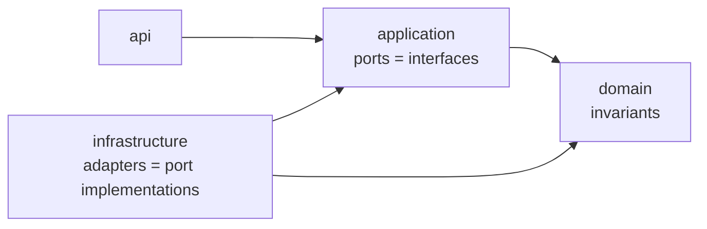

-- **PostgreSQL** --

        docker compose up -d
        docker logs -f ticketing-postgres

Stop :

        docker compose down

#WARN -v supprime le volume, à utiliser en conscience

        docker compose down -v

-- **RUN** --

        mvn spring-boot:run -e
        mvn -B clean test

-- **DB & migrations (Flyway)** --

Scripts : src/main/resources/db/migration
Convention : V1__init.sql, V2__...sql, …
Flyway applique automatiquement les migrations au démarrage.

-- **Swagger** --

 http://localhost:8080/swagger-ui/index.html

**ARCHI Hexagonale**

*Objectif* : isoler le cœur (métier + use cases) des détails techniques (HTTP, DB).

*api* : Concerne tout ce qui est visible de l'extérieur, endpoint, DTO, record, response, controlleur, endpoint
 - Dépendance : appelle application pour les use case et les DTO (modèle entré/sortie)
 - Indépendance : L'infrastructure doit être totalement décorélé de l'api
 - Pas de logique, que des actions listant les use case
 → appelle application, zéro logique métier, pas d’accès direct à infrastructure.

*domain* : Contient les règles métiers
 - Invariants (règles tjrs vrais), validation métier.
 - Aucun lien avec spring/JPA/HTTP
 - Contient idéalement : Entité, Value Object, Service domaine si nécessaire, exceptions métier
 → aucune dépendance Spring/JPA/HTTP (ex: transitions de statut autorisées).

*infrastructure* : Contient les liens externe vers la BDD et les autres action possible vers des systèmes externes (impl)
 - JPA entities + Spring Data repos
 - détails techniques (DB (JPA/Spec), files, HTTP clients). Implémente les ports.
 → traduit les besoins applicatifs en requêtes techniques.

*application* : Orchestre la logique métier et ressence les cas d'utilisation (contrat, use cases)
 - Ne doit pas faire du métier, elle coordonne le domaine
 - Dépend d'interfaces (ports), pas de classes infra concrètes
 → dépend du domain + ports (interfaces), pas des implémentations DB.

*Norme hexagonale, c’est :*

 - Dépendances dirigées vers le cœur

 - Ports/adapters aux frontières

 - Domaine isolé

TODO : Protéger avec auth le metrics/prometheus

Grace à actuator (métric) + prometheus (scraping) + grafana (visualisation)

 SLA / perf : temps de réponse p95/p99
 Qualité : taux de 4xx/5xx
 Santé : mémoire, threads, GC
 Capacité : nombre de requêtes, throughput
 Alerting : notification quand ça dérape

Grafana

 http://localhost:3000/

Prometheus

 http://localhost:9090/
 http://localhost:8080/actuator/prometheus