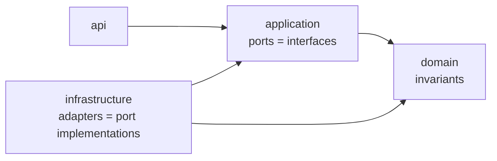

-- **DOCKER** --

        docker compose down
        docker compose up

#WARN -v supprime le volume, à utiliser en conscience

        #docker compose down -v#

restart

        docker compose restart ticketing-api

recompile + relance l'api

        docker compose up -d --build ticketing-api

log (postgres ; api ; grafana ; prometheus)

        docker logs -f ticketing-postgres

Pour rebuild api en vidant le cache

        docker compose down
        docker compose build --no-cache --pull api
        docker compose up

-- **RUN** --

        mvn spring-boot:run -e
        mvn -B clean test

-- **DB & migrations (Flyway)** --

Scripts : src/main/resources/db/migration
Convention : V1__init.sql, V2__...sql, …
Flyway applique automatiquement les migrations au démarrage.

-- **ARCHI Hexagonale** --

*Objectif* : isoler le cœur (métier + use cases) des détails techniques (HTTP, DB).

*api* : Concerne tout ce qui est visible de l'extérieur, endpoint, DTO, record, response, controlleur, endpoint
 - Dépendance : appelle application pour les use case et les DTO (modèle entré/sortie)
 - Indépendance : L'infrastructure doit être totalement décorélé de l'api
 - Pas de logique, que des actions listant les use case
 → appelle application, zéro logique métier, pas d’accès direct à infrastructure.

*domain* : Contient les règles métiers
 - Invariants (règles tjrs vrais), validation métier.
 - Aucun lien avec spring/JPA/HTTP
 - Contient idéalement : Entité, Value Object, Service domaine si nécessaire, exceptions métier
 → aucune dépendance Spring/JPA/HTTP (ex: transitions de statut autorisées).

*infrastructure* : Contient les liens externe vers la BDD et les autres action possible vers des systèmes externes (impl)
 - JPA entities + Spring Data repos
 - détails techniques (DB (JPA/Spec), files, HTTP clients). Implémente les ports.
 → traduit les besoins applicatifs en requêtes techniques.

*application* : Orchestre la logique métier et ressence les cas d'utilisation (contrat, use cases)
 - Ne doit pas faire du métier, elle coordonne le domaine
 - Dépend d'interfaces (ports), pas de classes infra concrètes
 → dépend du domain + ports (interfaces), pas des implémentations DB.


*Norme hexagonale, c’est :*

 - Dépendances dirigées vers le cœur

 - Ports/adapters aux frontières

 - Domaine isolé

Dit autrement, l'utilité principale de l'hexagonal est de faire en sorte d'isolé les règles métiers et les cas d'usage.
On greffe au domain des interfaces (port) qui eux sont implémentés ailleurs (adapter).
De cette manière, on va réduire fortement l’impact sur la logique métier.
Donc, mes use case ne connaissent pas Posgres, Mongo, Spring, HTTP, ils ne connaissent que des interfaces.

Cas concret :
- Migrer de Postgres vers Mongo (ou cohabitation)
- Passer l'API REST à event-driven (Kafka/Rabbit)
- Remplacer Stipe par Adyen / Paypal

Les raisons de choisir cette architecture

Tu as des dépendances externes (BDD, API, queue, fichiers, mail, cache…)
Tu prévois des changements de techno (ou tu veux éviter d’y penser)
Tu veux tester fort ton métier sans infrastructure
Tu as plusieurs entrées (REST + batch + event)
Ton domaine est non trivial (règles métier, cas limites, validations, états)



TODO : Protéger avec auth le metrics/prometheus

Grace à actuator (métric) + prometheus (scraping) + grafana (visualisation)

 SLA / perf : temps de réponse p95/p99
 Qualité : taux de 4xx/5xx
 Santé : mémoire, threads, GC
 Capacité : nombre de requêtes, throughput
 Alerting : notification quand ça dérape

### Config grafana
1. Créer un fichier `.env` à la racine (non versionné) :

```env
GRAFANA_ADMIN_PASSWORD=admin
```

API : http://localhost:8080

Swagger : http://localhost:8080/swagger-ui/index.html

Actuator : http://localhost:8080/actuator/health
            & 
           http://localhost:8080/actuator/prometheus

Prometheus : http://localhost:9090

Grafana : http://localhost:3000